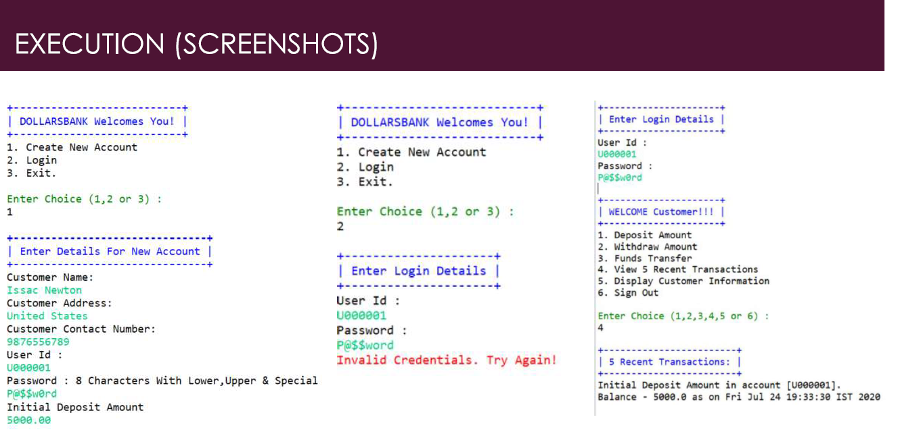
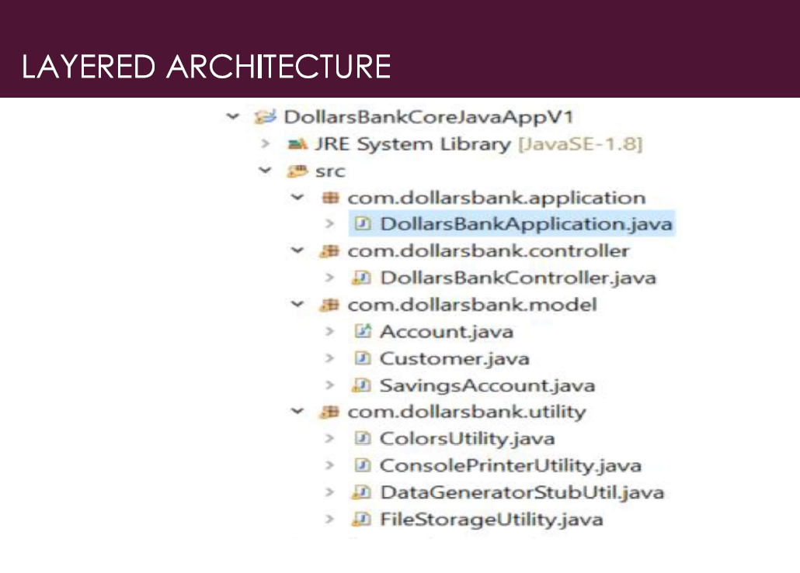

# Cognixia-SpringBoot-DollarsBankProject
A Spring Boot Project called DollarsBankCoreJavaAppVl in the Banking Domain

### Application Type: Console App
### Architecture Used: Layered Architecture
### User Interface: Menu based with multicolor

## Objectives
- Use layered architecture (abstracted files under SOLID principles) to make an MVC banking application.
- Create a user login system (no DB necessary, use in program memory).
- Once logged in, have a user menu isplay in console.
- Allow user to make:
a. Deposit
b. Withdrawl
c. Funds Transfer
d. 5 recent transaction history
e. Display customer information
f. Sign out
- Apply business logic to handle illegal
operations in:
a. login system
b. Transactions (withdrawls /
depsosits, etc.)
- BONUS - use JDBC and DAO to connect user info to a database.

- project screenshot

- layered architecture

